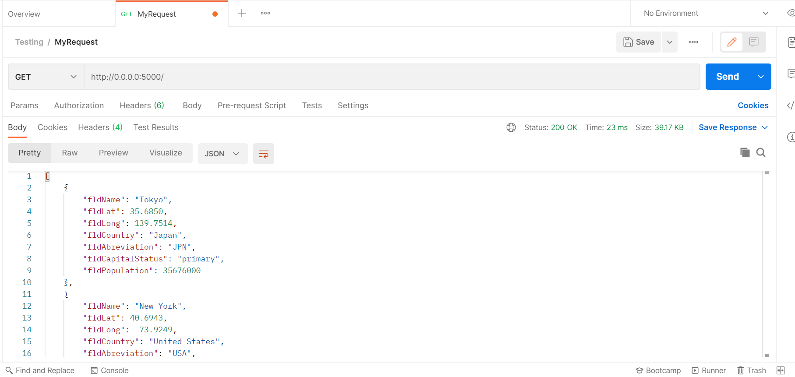
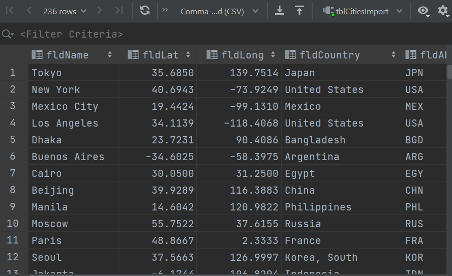
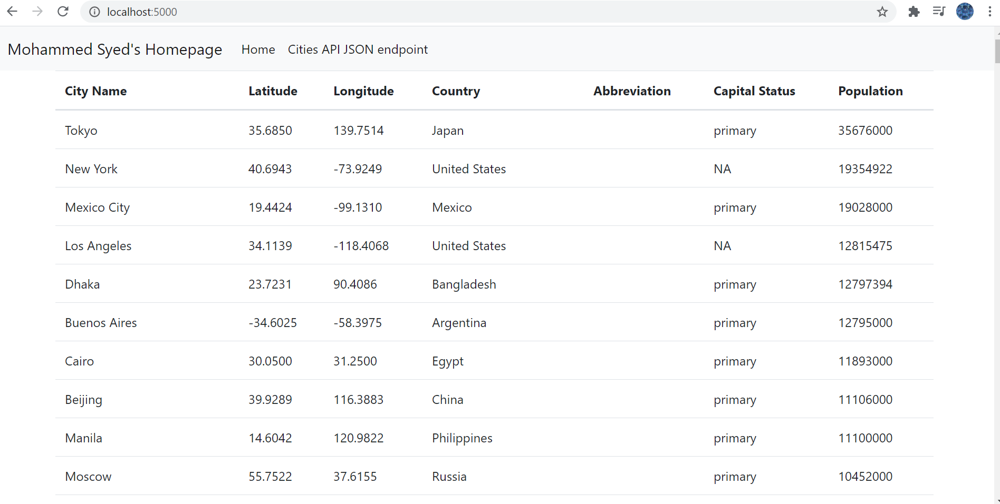

# Mohammed Syed
## Project Description
This project is a homework assignment to teach how to get Pycharm setup with Docker, Flask, MySQL

## Screenshots
Postman Screenshot:

SQL Data Screenshot:

Homework 2 Screenshot:

Please view screenshots folder if above images do not display.
